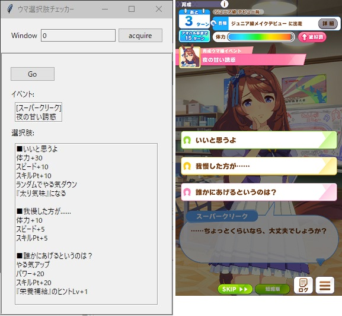

# name

uma

## Overview

育成シナリオの画面をキャプチャして選択肢の情報を表示します.

## Requirement

- Windows

- Python3

- pywin32

- Pillow

- pyocr+Tesseract

## Usage

pythonでuma.pyを実行.

DMM版で育成シナリオプレイ中に「Go」ボタンを押下で選択肢の情報が表示される.

## Description

- 選択肢のデータは付属しません. Sorry, choise database is not included in this repository.

## Author

Orion78cvz (Okinawa Bunmei)

## Licence

This project is licensed under the terms of the MIT license.
